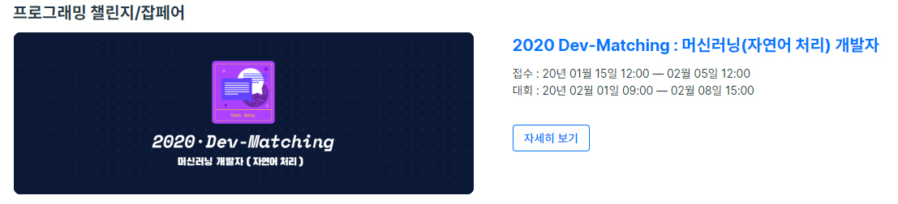
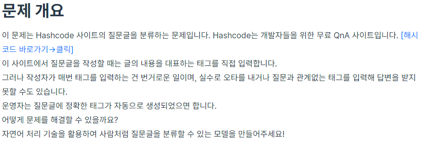
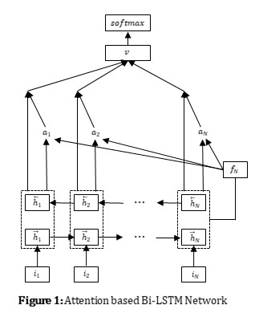
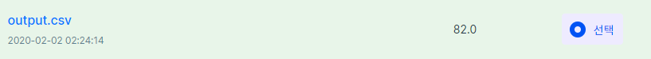

# 2020 Dev-Matching NLP Challenge
## 2020 Dev-Matching : 머신러닝(자연어처리) 챌린지

 
 
  

### 목표

해시코드 사이트의 질문글을 분류하는 것(c, c++, java, javascript, python)

### 사용한 모델

 
 
### 성능

핵심 키워드로 처리 가능한 문제는 먼저 해결하고, 학습한 모델로 애매하거나 어려운 문제 해결했다.

Acc: 82

  
  
